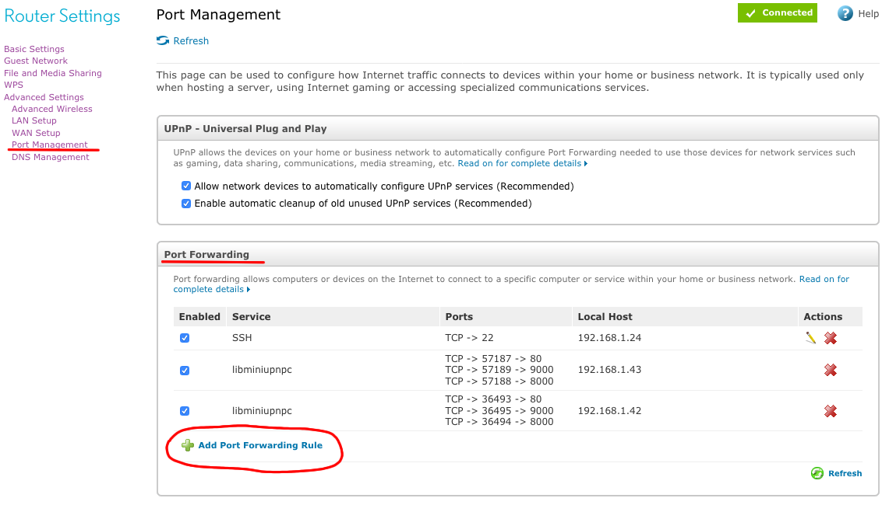
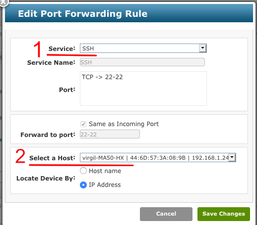

# Openssh Port forwarding

1. Connettersi al router ed abilitare la porta 22
> ogni router ha un interfaccia diversa, per cui non posso dirti passo per passo cosa devi fare. ti faccio vedere come vedo io e quali paroli chiavi cercare. ovviamente io ho i nomi in inglese quindi applica il tuo buon senso se sono scritti in italiano
* **Port management**: sarebbe dove vedo le porte del router
* **Add Port Forwarding Rule**: per aggiungere una nuova porta
* **Service**: nel mio caso quest opzione mi da una lista lunga di preset da cui scegliere dove cerco **SSH**. di conseguenza lui fa tutto da solo e riempie il resto per me. Nel caso non dovessi avere questa lista suppongo che basta che copi cosa ho io.
* **Select a Host**: qui di nuovo mi da una lista di tutti i device connessi al router. in questo caso io ho scelto il computer nel quale mi voglio connettere. nel tuo caso il computer dovrebbe essere il linux. dovresti riconoscerlo dal nome. per esempio quel *virgil-MA50-HX* è il nome che vedo nel terminale `virgil@virgil-MA50-HX:~$`.
* poi ovviamente **salva le modifiche**.

1. Controllare se firewall esiste ed/o è attivo
    1. sul terminale scrivi:

            sudo ufw status
    2. potrebbe dirti **inactive** o **active**. se dice **active** allora scrivi

            sudo ufw allow 22

2. Prendere l'indirizzo ip esterno. scrivi sul terminale

        wget -qO- ifconfig.me